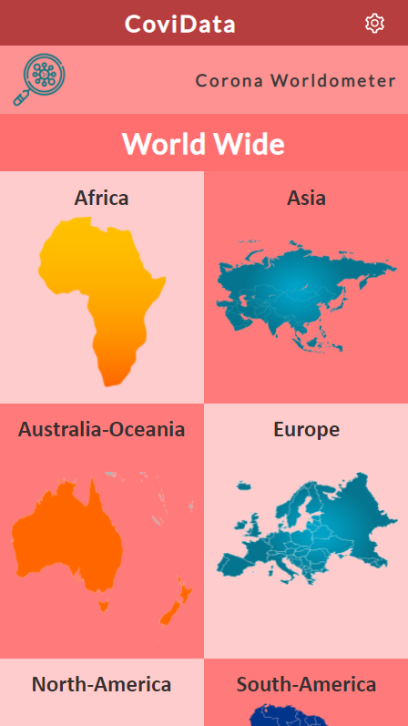
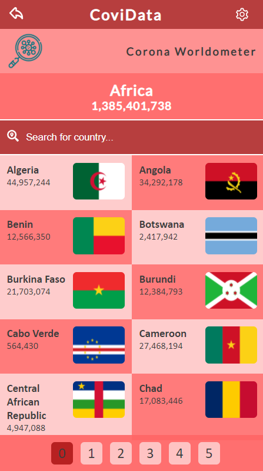
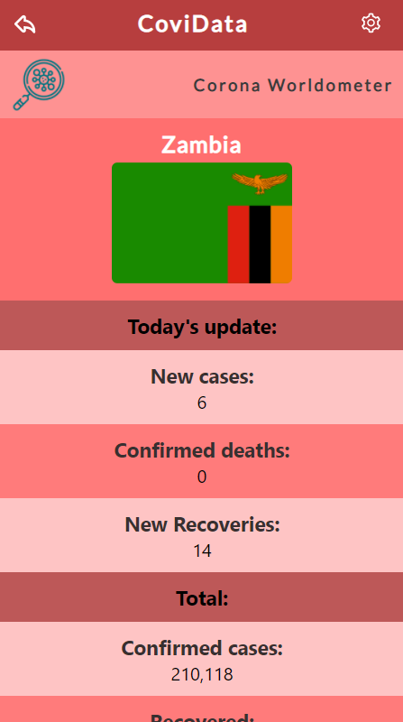

# CoviData Metrics Webapp
This project is a mobile web application used to check a list of COVID-19 metrics worldwide.

## Built With
- JavaScript/React
- Redux
- React Router
- JSX
- CSS
  
## Setup
- Get the link of the repository: [https://github.com/chaw-bot/react-capstone-project](https://github.com/chaw-bot/react-capstone-project)
- Clone it as [git@github.com:chaw-bot/react-capstone-project.git](git@github.com:chaw-bot/react-capstone-project.git) on a Terminal
- Usage
- Run npm install on a Terminal to install the modules
- Run npm start on a Terminal to start the server

## Links
- Click [here](https://effulgent-pegasus-151d85.netlify.app/) to view it in the browser.
- [Loom video]()
  
## Author

👤 **Silvia Tofana **

- GitHub: [@silviatofana](https://github.com/silviatofana)
- LinkedIn: [@silviatofana](www.linkedin.com/in/silvia-tofana-10b852186)
- Twitter: [@silviatofana](https://twitter.com/SilviaTofana)

## 🤝 Contributing

Contributions, issues, and feature requests are welcome!

Feel free to check the [issues page](https://github.com/silviatofana/react-capstone-/issues).

## Show your support

Give a ⭐️ if you like this project!

## Acknowledgments
Microverse
React and React Router documentation
Hats off to [Nelson Sakwa](https://www.behance.net/sakwadesignstudio) for the design inspiration.